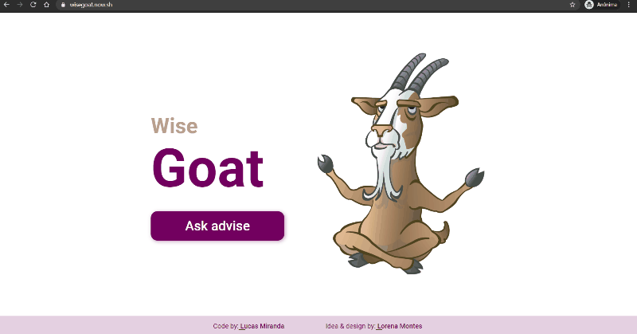

# :goat: Wise Goat

Website generator of goats images and advices

<!-- - [ ] Badges -->

 <a href="#about">About</a> •
 <a href="#technologies">Technologies</a> • 
 <a href="#contributing">Contributing</a> • 
 <a href="#authors">Author</a> • 
 <a href="#license">License</a>

  

## About

This project is a front-end challenge from [DevChallenge](https://devchallenge.com.br).

It is a very simple website where people can see advices by goats.

<!-- - [ ] Features -->

## Technologies

- Node.js
- React.js
- Next.js

<!-- - [ ] Pré-requisitos e como rodar a aplicação/testes -->
## Contributing

All contributions are very welcome

- ⭐️ Star the project
- 🐛 Find and report issues
- 📥 Submit PRs to help solve issues or add features

## Authors

- Code: [Lucas Miranda](https://github.com/lucas-lm)
- Idea & Design: [Lorena Montes](http://github.com/lorenalgm)

## License

This project is under the MIT license. See the [LICENSE](https://github.com/lucas-lm/wisegoat/blob/master/LICENSE) for more information.
